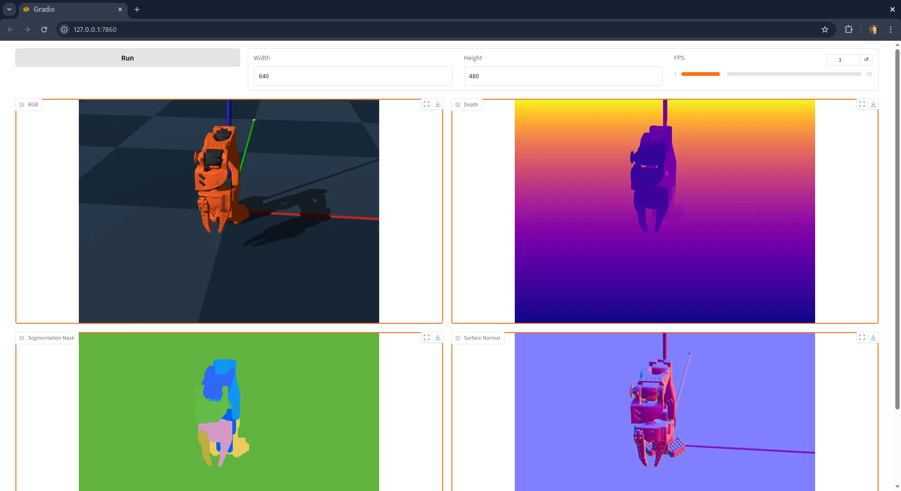
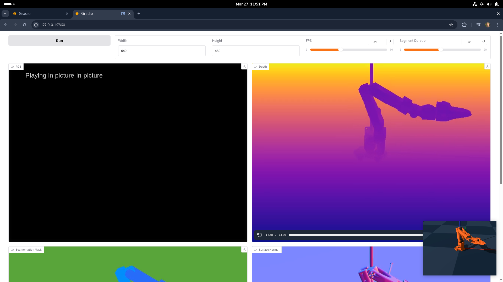

### Gradio apps

Gradio app is a UI web framework to demo ML applications.

Navigate to the [local URL](http://127.0.0.1:7860) in the browser. Then click _Run_ button.

#### Image

The [`Image` component](https://www.gradio.app/docs/gradio/image) can sample the frames of the simulation at a small FPS rate.
The frontend receives backend events via a Server Side Event stream. For each new _frame generated_ event, it downloads the image from the webserver and displays it to the user.

```
PYOPENGL_PLATFORM=egl python scripts/sim_gradio_image.py
```



#### Video

The [`Video` component](https://www.gradio.app/docs/gradio/video) can play a full mp4 encoded in h264 or a stream of smaller TS files.

```
PYOPENGL_PLATFORM=egl python scripts/sim_gradio_video.py
```



#### Qpos

The qpos app displays the joint angular position numbers.


```
python scripts/sim_gradio_qpos.py

2025-04-02 00:45:17,551 - INFO - Sending qpos [1.4888898134231567, -1.8273500204086304, 2.3961710929870605, -0.5487295389175415, 1.5706498622894287, -2.59892603935441e-05]
```

A client connects to the server to receive the qpos updates.

It can then dispatch them to the robot at a predefined `fps` rate to control its position.

```
python scripts/sim_to_real_client.py

2025-04-02 00:45:17,764 - INFO - Received qpos (1.49, -1.83, 2.4, -0.55, 1.57, -0.0)
```

#### Plot

The [Plot component](https://www.gradio.app/docs/gradio/plot) can display a chart. Dashboard monitors key metrics in dedicated [Tab](https://www.gradio.app/docs/gradio/tab)s.

- **qpos**, in _rad_
- **velocity**, in _rad/sec_
- **control force**, in _N.m_

```
python scripts/sim_gradio_dashboard.py
```


