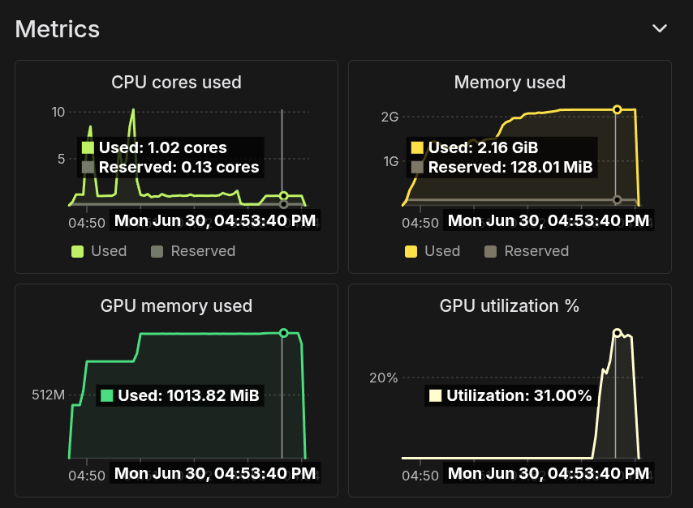

# Real To Sim

Consider a [LeRobot dataset](https://huggingface.co/datasets/alexis779/so100_ball_cup) created via teleoperation.

*Visualize Dataset* [HuggingFace space](https://huggingface.co/spaces/lerobot/visualize_dataset?path=%2Falexis779%2Fso100_ball_cup%2Fepisode_1%3Ft%3D23) is an interactive tool to visualize episodes from the dataset.

| real | sim |
|----------|-------------|
| <video controls src="https://github.com/user-attachments/assets/fbaef5c9-7767-4aff-b879-4f7f59e993c4"></video> | <video controls src="https://github.com/user-attachments/assets/f260e84e-946b-4c74-9e06-4e36dab704a2"></video> |


Following script replays the select tele-operated episodes.

It replays each frame of the episode dataset into a dedicated simulation environment, using the same FPS as the camera.

It sends control command using the follower robot state `qpos` as input.

The simulator executes all the environments steps in parallel.

## Local run

```
PYOPENGL_PLATFORM=glx python scripts/sim/replay_episodes.py --dataset_repo_id alexis779/so100_ball_cup2 --episode_id 0,1,2,3,4,5,6,7,8
```

## Remote run

Replay the full tele-operated dataset on modal, with all the episodes replaying at the same time, on the GPU / Cuda backend.

```
modal run scripts/sim/calibrate_params.py::replay_episodes --dataset-repo-id alexis779/so100_ball_cup2
```

The logs indicate the breakdown of the execution into substeps, for a total of 4 minutes.

1. Initialization (~ 20 sec)
2. 3D model convex decomposition of the robotic arm parts and objects of the scene (~ 1 min)
3. Scene building (~ 10 sec)
4. Simulation Kernel compilation (~ 1 min 20 sec)
5. Execution of the simuation (~ 1 min 40 sec)

```
[Genesis] [23:49:58] [INFO] ╭───────────────────────────────────────────────╮
[Genesis] [23:49:58] [INFO] │┈┉┈┉┈┉┈┉┈┉┈┉┈┉┈┉┈┉┈ Genesis ┈┉┈┉┈┉┈┉┈┉┈┉┈┉┈┉┈┉┈│
[Genesis] [23:49:58] [INFO] ╰───────────────────────────────────────────────╯
[Genesis] [23:49:58] [INFO] Running on [NVIDIA A10] with backend gs.cuda. Device memory: 22.07 GB.
[Genesis] [23:49:58] [INFO] 🚀 Genesis initialized. 🔖 version: 0.2.1, 🌱 seed: None, 📏 precision: '32', 🐛 debug: False, 🎨 theme: 'dark'.

[Genesis] [23:50:08] [INFO] Running convex decomposition.

[Genesis] [23:50:55] [INFO] Building scene <776204b>...

[Genesis] [23:51:08] [INFO] Compiling simulation kernels...

[Genesis] [23:52:25] [INFO] Building visualizer...

[Genesis] [23:54:02] [INFO] 💤 Exiting Genesis and caching compiled kernels...
2025-06-30 23:54:03,146 - INFO - Dataset alexis779/so100_ball_cup2 score = 0.6730769276618958
Stopping app - local entrypoint completed.
```




| 4 | 9 |
|----------|-------------|
| <video controls src="https://github.com/user-attachments/assets/f81a4fad-8572-4b24-98b7-d60a475ce848"></video> | <video controls src="https://github.com/user-attachments/assets/b94ce651-839a-4c8e-89a9-a34d30e7de08"></video> |