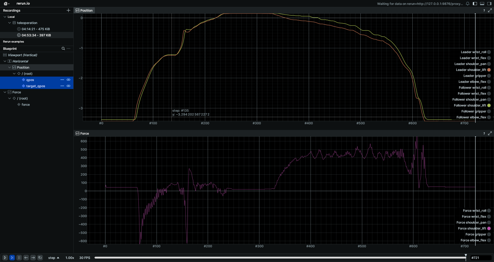

# Tele-operation

Run tele-operation, controlling the follower using the leader position.

```
python scripts/teleop/teleoperate.py
```

The robot state for both the leader and the follower can be visualized in rerun.io viewer.

Each joint chart contain 3 metrics
- the leader motor position
- the follower motor position
- the genesis entity qpos




## Gradio app

```
python scripts/teleop/gradio_control_app.py
```